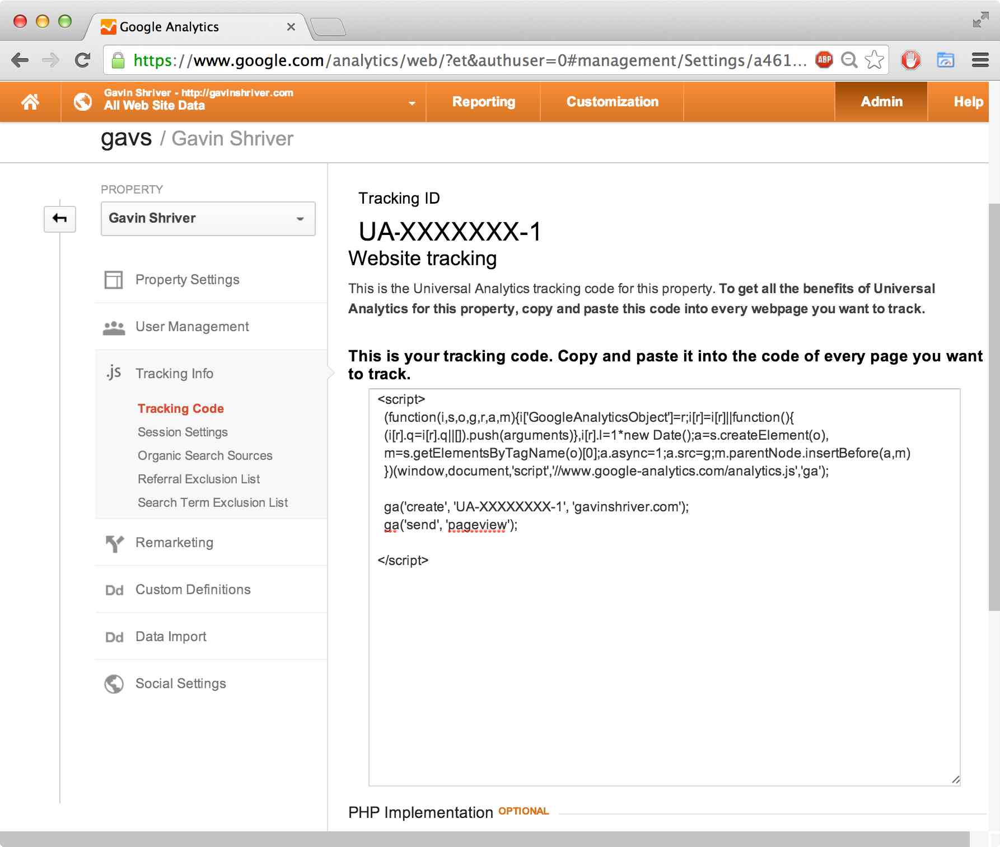

ab.js
=====

Easy AB-testing using HTML markup and Google Analytics.

  We hope you're excited about getting the most out of your website! This guide will help you get set up and show you how to create tests, define goals, and view your results. If you have any questions, don't hesitate to shoot us an email at [support@inlineab.com](mailto:support@inlineab.com).

------------------------------------------------------------------------------------------------------------------------

Click ahead!

1. [Getting Started](#gettingstarted)
  1. [Register with Google Analytics](#registerGA)
  2. [Download InlineAB](#download)
  3. [Write Some Tests](#writeTests)
  4. [Define Your Goals](#defineGoals)
  5. [Optimize Your Everything](#optimize)
  6. [What's next?](#whatsNext)
2. [Supported Commands & Syntax](#commands)
  + [Markup](#commandMarkup)
  + [CSS & Styling](#commandCSS)
  + [ab-goals](#commandabgoal)
  + [ab-ratio](#commandratio)
3. [Google Analytics Support](#gasupport)
  + [Finding GA Tracking Snippet](#(gaFindSnippet)
  + [Viewing My Results](#results)
4. [Support](#support)
  + [General](#generalSupport)
  + [Angular Users](#angularSupport)
  + [Best Practices](#bestPractices)
  + [Troubleshooting](#troubleshooting)
5. [Examples](#examples)
  + [Site Logo](#exImage)
  + [Site Heading](#exHeading)
  + [Buy Now Link](#exLink)
  + [Crazy CSS](#exCSS)
6. [Sites using InlineAB.js](#sitesusingus)
7. [Licensing & Usage](#licensing)

------------------------------------------------------------------------------------------------------------------------

Getting Started! 
------

### 1. Register with Google Analytics 

  To use InlineAB, you'll need a Google Analytics profile for your website. Go ahead and make one [here](https://www.google.com/analytics/web/provision?et=&authuser=#provision/CreateAccount/). Make sure to select the new 'Universal Analytics' account type.

  Once you're registered, you'll need to copy your [Google Analytics Tracking Snippet](#gaFindSnippit) into your webpage - you'll need this to link your tests to your new analytics account. Don't worry if Google Analytics looks a little confusing! We'll handle all the hard work for you. If you need more with Google Analytics check out our [Google Analytics Support Section](#gasupport)

> 

### 2. Download InlineAB 

##### General
  To run tests with InlineAB, you'll need a copy of our library. You can download one [here](http://www.inlineab.com/inlineab.js). You can put this file with all of your other Javascript files, or in the same place as your html page if you aren't using any other Javascript. Remember to include your `
        ...
      </head>
      <body
        ...
      </body>
    </html>

##### Using Bower
  InlineAB.js is also avaliable on Bower! Just type the code below to include into the console!

    bower install --save inlineab

###### Note:
  Be sure to inclue inlineab.js as one of your first scripts to ensure the fastest switching between test elements. It is recommended Angular.js users include this script tag before their angular.js script. [Read More.](#angularSupport) 

### 3. Write Some Tests 

  With InlineAB, you can write tests directly into your HTML. The syntax is easy: just wrap whatever you want to test in an <abtest> tag, and give names to your test and the different possible experiences. Here's an example, which we'll break down below:

    <abtest test-name='header-text'>
      <h1 exp-name='hello'>Hello!</h1>
      <h1 exp-name='hi'>Hi!</h1>
    </abtest>

##### What's going on here?
  The outer tags are special `<abtest>` tags. They're used to indicate that a set of elements should be grouped together as a single AB test. Users will see one of the elements inside the `<abtest>` tag. The element you see is the chosen experience. For instance, in our example above, a user would (at random) be shown either "Hello!" or "Hi!" as the header. Whenever inlineAB detects an `<abtest>` tag on the page, it will immediately choose one of the experiences, deleting the others and the `<abtest>` tag itself. No trace of your AB test will be left on your page, and the processing occurs only a few miliseconds after the tag is created.

  You should also notice the attributes `test-name` and `exp-name`. The first attribute is placed on the `<abtest>` tag and tells inlineAB what you want your test to be named. We called this test `header-text` because it's deciding between two different header text choices. The second attribute, `exp-name` is placed on each of the possible experiences and should describe the experience contained within that tag. Make sure these names are memorable! You'll need them when you view your analytics.

###### Note 1:
  InlineAB.js supports class & style switching as well as any other html element from images to paragraphs and titles. [Checkout Supported Commands & Syntax for more information.](#commands)

###### Note 2:
  Try to make your `test`, `experience`, and `goal` (see below) names less than 60 characters. This is due to a possible limitation of Google Analytics. 
  

### 4. Define Your Goals 
  Once you have some tests, you'll want to define a goal or two. These are your conversion events - the things that you want to happen. This can include user interaction like clicks and key presses, or passive events like page views. These goals will then be available to you when you log into Google Analytics later. Here's how you define goals - we'll explain below:

    <abgoal goal-name='header-text' goal-action='click'>
      <button>Purchase!</button>
    </abgoal>

What's going on here?
  Anything wrapped in an `<abgoal>` tag is designated as a goal, and every time the user performs the action listed under `goal-action`, InlineAB sends a message to Google Analytics. As with `<abtest>`, the tag will be erased almost immediately and leaves no trace on the page.

### 5. Optimize Your Everything 
  Now that you've defined tests and goals, your results will begin appearing in Google Analytics. Google's service is incredibly deep and can be confusing to navigate, so we've written a [guide](#results) to help you get the most out of the service, which you can find here.

  Remember that AB testing takes time, and you'll have to wait till you have data to realize the benefits. <del>Google Analytics can help notify you when there's enough evidence to conclude one of your tests. We've included instructions on setting this up in our guide.</del>

### 6. What's Next? 
  Inline AB has plenty more to offer! You can continue reading the documentation - it covers more advanced features and provides some common use cases. And if you enjoy our work, feel free to fork us on Github and suggest improvements!

------------------------------------------------------------------------------------------------------------------------

Supported Commands  
------

### Text and other markup  
  As outlined in the [Getting Started](#gettingStarted) section, abtest supports the swapping of any kind of HTML element. Simply wrap the element in `<abtest> </abtest>` with the correct attributes. InlineAB.js also allows you to swap deeply nested elements.  Here are a few examples:

1. Testing a heading: 

    <abtest test-name="heading">
      <h1 exp-name="assertive"> The best web page in the World! </h1>
      <h1 exp-name="modest"> A decent webpage that exists. </h1>
      <h1 exp-name="silly"> This webpage is not a webpage. </h1>
      <h1 exp-name="selfDeprecating"> This is a sad, sad webpage. </h1>
    </abtest>

2. Testing an image: 

    <abtest test-name="mascot">
      
      
      
    </abtest>

3. Testing a link:

    <abtest test-name="buyButton">
      <button exp-name="buyNow"> Buy Now! </button>
      <button exp-name="buyToday"> Buy Today! </button>
      <button exp-name="dontBuy"> Don't Buy!</button>
    </abtest>

4. Nested `div`s.

    <abtest test-name="headlines">
      

        <h1> This is a Title! </h1>
        
 I'm a sample paragraph. 

      

      

        <h1> I'M A MEAN TITLE! AND I DON'T LIKE YOU!</h1>
        
 I DON'T LIKE THE WAY YOU'RE LOOKING AT ME. 

      

    </abtest>

### CSS and Styles 
  Testing styles and CSS can be done in several different ways. Here are a few other 

### abgoal 
  Goal are used to track users' actions. This is especially important when trying to funnel users to a specific page. For example, 'subscribe' 
, 'register', or 'checkout' pages. In these cases it is adventagious to track which experiences a user had before getting to to the goal. Thus we have `abgoals`. The `abgoal` tag can wrap any DOM element with a tag and add a particular event to listen to. A full list of supported events is below.

##### Supported Events:
+ mouse events:
  - click, dblclick, mousedown, mouseup, mouseover, mouseout, dragstart, drag, dragenter, dragleave, dragover, drop, dragend, keydown
+ keyboard events: 
  - keyup, keydown, keypress
+ html form events:
  - select, change, submit, reset, focus, blur
+ touch events:
  - touchstart, touchend, touchenter, touchleave, touchcancel

------------------------------------------------------------------------------------------------------------------------

Google Analytics Support 
------
###### Note: 
  This section is here to help guide you through some of the rough patches when setting up Google Analytics. We are only trying to help because even we found the process of using GA difficult and un-intuative. However, by no means should this be considered the complete guide or reference to using Google Analytics. Also the GA website is subject to change without warning us. So if any information becomes out of date or can be fixed in one way or another, please submit a pull request!

### Finding GA Snippt 
  After signing up for Google Analytics the first page shows your Google Analytics Tracking Snippet. It looks something like this:

  The `UA-XXXXXXXX-1` is your unique Tracking ID that Google provides (yours should NOT contain `XXXXXXXX`).

  If you didn't find this snippet, or clicked out of the page too quickly to copy it. Don't panic!  Follow the steps below:

1. Go to [http://www.google.com/analytics/](http://www.google.com/analytics/)
2. On the top right, click on `Access Google Analytics`.
3. On the top right, click on `Admin`.
4. Under the `PROPERTY` column (the middle column) click on `.js Tracking Info`.
5. In the slide down menu click on `Tracking Code`.
6. Copy the code into the correct places on your site!

###### Important: 
  This must be placed <b>each</b> of your indpenedent html pages! For single page apps, most of the time the index.html file is sufficient.

### Viewing My Results 
  Google Analytics is awesome! Really! It provides a whole host of usefull information including locations, gender, age group, and more! However it doesn't always make these data easy to find. We strongly recommend playing around with Analytics to find out which extra information Analytics is providing that is specifically useful to you. You'll get lost... You might get frustrated... But you'll be on your way being a power user of GA for the effort you put in. Because GA can be a mess for the inexperienced we will instruct you on how to access the data InlineAB helping you collect.
  
##### What's InineAB.js doing?
  InlineAB.js is tracking the users on your site using Events. There are events which describe what is being loaded on a page and there are events that describe actions a user has taken such as `clicks`, `mouseovers`, and `keyups`.  The latter group tracks goals.

##### Where is my data?
1. Go to [http://www.google.com/analytics/](http://www.google.com/analytics/)
2. On the top right, click on `Access Google Analytics`.
3. There should be a list of websites in folders at the bottom should be `All Web Site Data` click on it.
4. On the navigation bar `Reporting` should be highlighted. This is the main page for viewing your results -- your "Overview Page".
5. AB testing results for inlineAB.js can be found by selecting 

##### Usefull Views.
  Here are a few of Google Analytics' most useful views: 
  
+ Finding AB Events Flow
  - On the left navigation bar, under `Behavior` click on `Events`.
  - Under `Events` click on the last link `Events Flow`.
  - This view shows the flow of of events. Which things varous users have seen and what lead to the next event. 
+ Finding AB Overview
  - On the left navigation bar, under `Behavior` click on `Events`.
  - Under `Events` click on the last link `Events Flow`.
  - This view shows the percentages of what

##### Making use of it.
  By looking at your results on the GA pages you can see the best trend -- the most used or preferred test. Although we wish we could help more its up to you to look at your data and make the decision of what to do next. Check the pages listed above for good references on how your data is working out!

------------------------------------------------------------------------------------------------------------------------

Support 
------

### General Support 

  InlineAB was written and optimized to fully support modern browsers and browsers down to Internet Explorer 8. It can support single page and multipage apps as well as common frameworks such as [Backbone.js](http://backbonejs.org) and [Angular.js](http://angularjs.org), as well as their derivatives. When using a framework with templates, AB tests should be included in the templates themselves. InlineAB.js can be used with any templating language that compiles into standard HTML with the correct syntax. 

### Angular Support 

  <b>Angular users</b> please note that InlineAB and Angular operate using periodic querying of the DOM. This sometimes leads to a quick flash of all tests when a page is loaded. Including the inlineab.js script ahead of your angular.js script tag can help with this problem.

### Best Practices 

##### 60 Characters or Less
  When choosing names for `abgoal`s, `test-name`s, and `exp-name`s it's a good idea to use 60 characters or less. There are two reasons for this. First of all, for readability. Long names may be cut off in Google Analytics and therefore difficult to read. Secondly, although not a verified issue Google Analytics may not allow ANY name over 128 characters -- InlineAB.js will concatinate two of these titles to make results easier to view thus, it is good practice to keep names and labels below 60 characters. 

### Troubleshooting 

  There are several things that can cause the same problems on the page. For any problem start off by reviewing the common solutions below.

##### Common Solutions 

1. Did you include your [Google Analytics Tracking Snippet](#gaFindSnippet)?
  - This must be on every page unique page you wish to track!
  - It should be added <b> before </b> the inlineAB.js script.
2. Did you add the inlineAB.js [`<script>`](#download) tag to your index file?
3. Are all your HTML script tags properly closed? ex: `` AND ``.

##### Results are not showing up in Google Analytics! 
1. Check the [Common Solutions](#commonSolutions)!
2. After first setting it up, Analyics may take up to two days to populate your results. However realtime results should be viewable. Take a look at that tab in GA.

##### All possible tests are displaying on the page!
1. Check the [Common Solutions](#commonSolutions)!
  - This happens most commonly when inlineAB.js does not load

##### I see a flicker before the page finishes loading!
1. Try moving inlineAB.js script tag before all other scripts. Angular users are more likely to experiece page flicker. 

------------------------------------------------------------------------------------------------------------------------

Sites Using inlineAB.js 
------
+ [www.inlineab.com](http://inlineab.com)

------------------------------------------------------------------------------------------------------------------------

Licensing & Usage 
------

  We are licenced under CC BY-SA. You can find the full license [here](http://creativecommons.org/licenses/by-sa/4.0/legalcode), however in summary:
  You may share or adapt this software for any purpose, even commercially, as long as you, give appropriate credit, provide a link to the license, and indicate if changes were made. If you remix, transform, or build upon inlineAB, you must distribute your contributions under the same license as the original.